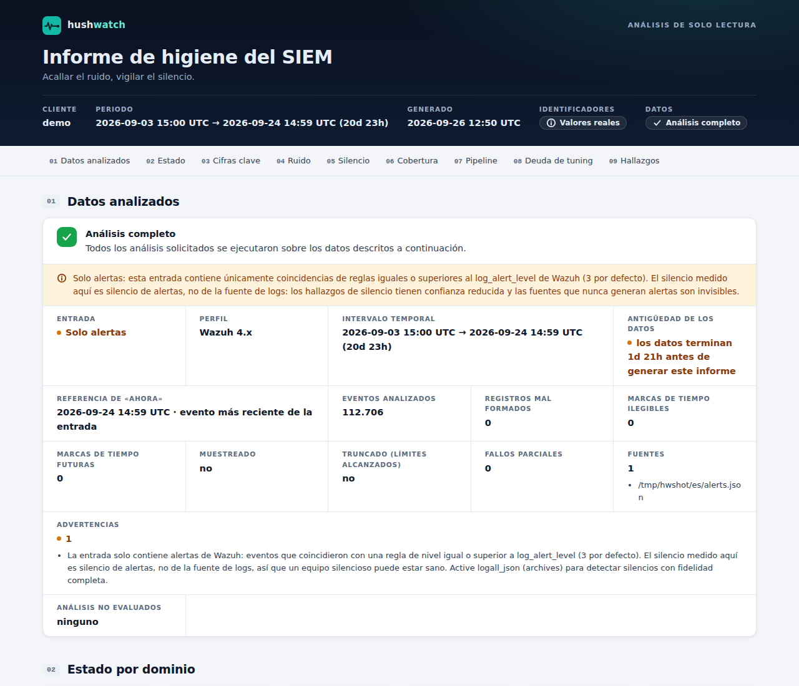
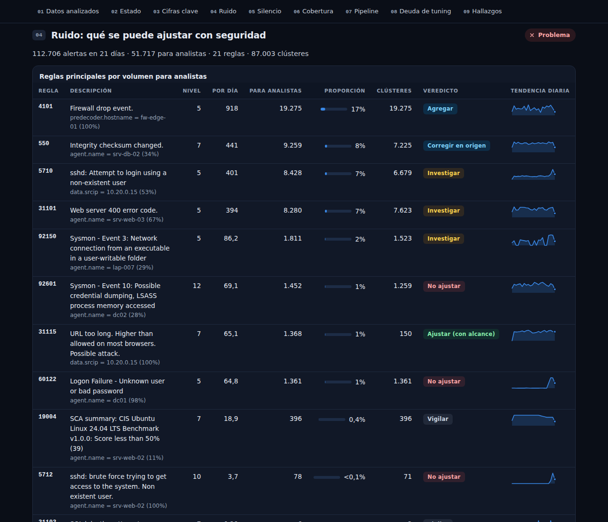

<div align="center">

# hushwatch

**Acallá el ruido. Vigilá el silencio.**

Higiene de SIEM para equipos blue team: encontrá las alertas que podés ajustar **sin riesgo** y las detecciones que
**dejaron de funcionar en silencio**. Soporte de primera para Wazuh; también Elastic / OpenSearch y exportaciones
genéricas.

[](https://github.com/yosoyelpablo/limpiado-de-ruido/actions/workflows/ci.yml)


[Read in English](README.md)



</div>

---

## Por qué

Todo SOC pelea contra los mismos dos problemas, que son dos caras de la misma moneda:

* **Ruido.** Cerca de la mitad de las alertas son falsos positivos y ~42% nunca se investiga
  (Microsoft/Omdia 2026, SANS 2025). Los analistas se ahogan y los ataques reales se esconden en la cola.
* **Silencio.** Una fuente de logs deja de enviar, se cae el canal de Sysmon, un parser pierde un campo después de un
  update de firmware, alguien apaga una política de auditoría, una regla deja de disparar. Nada alerta sobre la
  *ausencia*, así que las detecciones mueren en silencio… hasta el incidente que no viste.

Las soluciones comerciales existen, a precio enterprise. hushwatch es la alternativa open source, construida
alrededor de una regla que la mayoría de las herramientas de tuning ignora:

> **El ruido se parece a los ataques.** Fuerza bruta, password spraying, escaneos y beaconing de C2 son de alto
> volumen, repetitivos y concentrados: justo lo que un script ingenuo de "reglas más ruidosas" te diría que
> silencies. hushwatch nunca recomienda un ajuste sin pasar controles de seguridad estrictos y un backtest.

## Arranque en 60 segundos

```bash
pipx install git+https://github.com/yosoyelpablo/limpiado-de-ruido
hushwatch demo --lang es   # dataset sintético de Wazuh con problemas plantados + reporte HTML. No hace falta SIEM.
```

Después apuntalo a tus datos:

```bash
# Manager de Wazuh (lectura de las alertas; ejecutalo como miembro del grupo 'wazuh', no como root)
hushwatch report /var/ossec/logs/alerts/alerts.json \
  --ruleset /var/ossec/ruleset/rules --ruleset /var/ossec/etc/rules --lang es -f html -o informe.html

# Reporte seudonimizado para compartir con un cliente o un proveedor
hushwatch report alerts.json --lang es --redact -f html -o informe-compartible.html
```

## Qué encuentra




| Dominio | Qué obtenés | Ejemplo |
|---|---|---|
| **Ruido** | Sugerencias de ajuste acotadas, con controles y backtest, más reglas de Wazuh listas para revisar | *"Regla 5710 desde el escáner interno 10.20.0.15 = 52% de la regla, todas las noches durante 21 días. Bajarle el nivel saca ~200 alertas por día de la vista del analista y no oculta ninguna alerta de severidad alta — requiere revisión: la regla de fuerza bruta 5712 cuenta estos eventos."* |
| | Reglas ruidosas que **no** hay que ajustar, y por qué | *"5710 desde 203.0.113.50: vista por primera vez hace 2 días, coincide con la regla de fuerza bruta 5712 (nivel 10) → investigar, o restringir la exposición."* |
| **Silencio** | Fuentes, canales y reglas que se callaron: calibrado y agrupado por causa raíz | *"dc02 dejó de enviar hace 30 h, 20 min después de 'se borró el log de auditoría' (1102) → posible evasión de defensas (T1070.001)."* |
| | Campos que desaparecieron | *"fw-edge-01 perdió `data.dstport` el 2026-09-20 (100% → 0%): toda regla que lo use quedó ciega."* |
| **Cobertura** | Telemetría que **nunca** se recolectó | *"srv-app-01 nunca envió Sysmon y sus pares Windows sí."* · *"srv-app-02 registra 4624 pero nunca 4688: la auditoría de creación de procesos está apagada."* |
| **Pipeline** | Agentes desconectados o vivos pero mudos, descartes del manager, retraso, relojes desfasados | *"srv-mon-01 tiene keepalive reciente pero no envía eventos hace 3 días: la recolección está rota."* |
| **Deuda de tuning** | Supresiones EXISTENTES riesgosas en tu `local_rules.xml` | *"La regla 100010 silencia toda la 5716 (sin condición) y deja sin datos a la regla de correlación 5720."* |

## Por qué podés confiar en el resultado

**Ruido: nunca esconder un ataque**
* Las sugerencias son **acotadas** (una regla más 1–2 condiciones exactas sobre campos estables, como host, IP
  interna o cuenta de servicio). Nunca "silenciá esta regla".
* **Controles de seguridad estrictos** deciden cada veredicto:
  * novedad, persistencia y picos;
  * coincidencia con alertas de severidad alta sobre la misma entidad;
  * tácticas MITRE sensibles;
  * IPs públicas (la respuesta es "restringir la exposición", no silenciar);
  * periodicidad tipo beacon;
  * intérpretes y binarios del sistema (PowerShell, cmd, rundll32...), que nunca alcanzan solos para ajustar;
  * reglas de las que dependen reglas de correlación;
  * verdaderos positivos confirmados.
* Cada sugerencia pasa por un **backtest**: se reproduce sobre toda la ventana con la misma semántica que la regla
  generada, y se degrada si ocultaría cualquier alerta de nivel alto o un verdadero positivo confirmado.
* Las reglas de Wazuh generadas **bajan el nivel** de la alerta (no la descartan, así que sigue siendo buscable) y
  usan patrones PCRE2 anclados y totalmente escapados. Wazuh no tiene vencimiento de reglas: cada regla lleva su
  fecha de vencimiento en la descripción y `hushwatch audit` informa las vencidas. Si otras reglas de correlación dependen de la regla
  ajustada (por ejemplo, una regla de frecuencia de fuerza bruta), o si se adelantaría a una regla hermana, la
  sugerencia queda marcada **REQUIERE REVISIÓN** con la lista exacta de reglas afectadas. Cada archivo trae un
  checklist de validación (`wazuh-analysisd -t`, `wazuh-logtest`, rollback).

**Silencio: calibrado, no ruidoso**
* El volumen esperado de cada fuente se modela por hora del día y día de la semana, en tu zona horaria (respeta los
  cambios de horario).
* Los conteos usan un modelo binomial negativo, porque los logs reales vienen en ráfagas.
* Una fuente se marca solo cuando la probabilidad de su silencio actual cae por debajo de un **presupuesto de
  alarmas** explícito (por defecto, 0,05 falsas alarmas esperadas por ejecución, sumando todas las fuentes).
* Una caída de toda la flota es **un** hallazgo de pipeline, no 400.
* Las fuentes críticas demasiado esporádicas para monitorear se informan como tales, nunca como "sanas".

**Nunca un falso verde**
* Todo reporte arranca con un recuadro de **base de datos analizada**: qué se analizó, si eran solo alertas o logs
  completos, el rango de tiempo, datos malformados y fallas parciales.
* Lo que no se pudo evaluar se muestra en gris, no en verde.
* Un análisis incompleto termina con código de salida 3.

**Probado contra ataques plantados.** El dataset de demo planta 26 escenarios. La suite de tests falla si hushwatch
sugiere ajustar algo que escondería alguno de los ataques plantados, o si da falsas alarmas sobre laptops sanas que
simplemente se apagan de noche:
* fuerza bruta, password spray y beacon de C2;
* una macro que lanza PowerShell codificado;
* borrado de logs antes de que un DC se calle;
* un canal de Sysmon que muere;
* un campo de firewall que se pierde;
* supresiones heredadas riesgosas.

## Lo que hushwatch nunca va a hacer

* **Escribir en tu SIEM.** Es de solo lectura: las reglas sugeridas son archivos para que los revise una persona.
* **Mandar datos afuera.** Sin telemetría, sin LLM, sin nube: solo se conecta a los endpoints que configures.
* **Recibir secretos por línea de comandos.** Las credenciales vienen de referencias `${VARIABLE}` en la
  configuración.
* **Desactivar TLS en silencio.** La verificación está activa por defecto; apagarla es un ajuste de configuración que
  aparece en cada reporte.

## Comandos

| Comando | Para qué |
|---|---|
| `hushwatch demo` | Genera un dataset realista de Wazuh con problemas plantados y lo analiza |
| `hushwatch report [ENTRADAS]` | Todo: ruido, silencio, cobertura, pipeline, deuda de tuning |
| `hushwatch noise [ENTRADAS]` | Solo análisis de ajustes (`--emit-suppressions DIR` escribe reglas de Wazuh) |
| `hushwatch silence [ENTRADAS]` | Solo silencio, cobertura y salud del pipeline |
| `hushwatch audit DIRS_REGLAS...` | Audita las supresiones de Wazuh existentes (pase también el ruleset de fábrica para verificar las correlaciones) |
| `hushwatch check` | Modo cron: ciclo de vida de hallazgos (nuevo / abierto / resuelto / reabierto / intermitente), avisa solo ante cambios, envía heartbeats |
| `hushwatch fleet` | Vista MSSP: todos los clientes lado a lado |
| `hushwatch doctor` | Diagnostica configuración, archivos, indexer, API de Wazuh y TLS, con la solución exacta |

Opciones comunes: `-f console|html|md|json`, `-o ARCHIVO`, `--lang en|es`, `--redact`, `--fail-on SEVERIDAD`,
`--since 21d`, `--now ISO`, `--dispositions veredictos.csv`, `--ruleset DIR` (repetible), `--agents agentes.json`,
`--force`, `-c config.yml -t cliente`.

> **Consejo:** pase siempre el ruleset de fábrica (`/var/ossec/ruleset/rules`) junto con sus reglas locales. Sin él,
> hushwatch no puede ver qué reglas de correlación dependen de una regla ruidosa, así que marca todas las
> sugerencias como REQUIERE REVISIÓN y el análisis queda como incompleto.

**Códigos de salida:**
* `0`: sin problemas;
* `1`: hay hallazgos iguales o superiores a `--fail-on`;
* `2`: error de uso o de configuración;
* `3`: análisis incompleto.

## Entradas

* **Wazuh 4.x:** `alerts.json` (en vivo, directorios rotados `.json.gz`, archivos partidos), `archives.json`, el
  indexer (`wazuh-alerts-*`, `wazuh-archives-*`) y la API del servidor (inventario de agentes, keepalive, contadores
  de descartes del manager).
* **Elastic / OpenSearch:** alertas ECS (`kibana.alert.*`, incluidos los motivos de cierre de los analistas como
  veredictos).
* **Cualquier otra cosa:** exportaciones NDJSON / JSON / CSV (Splunk, Sentinel...) con un mapeo de campos.

> **Consejo:** el `alerts.json` de Wazuh solo contiene eventos que dispararon una regla igual o superior a
> `log_alert_level`, así que el silencio medido sobre alertas es silencio *de alertas*. Para medir el silencio real de
> las fuentes, activá `logall_json` y apuntá hushwatch a `archives.json` / `wazuh-archives-*`. El reporte te dice qué
> le diste.

## Configuración (multi-cliente)

Un solo archivo YAML, con `defaults` que hereda cada cliente. Mirá [`examples/hushwatch.yml`](examples/hushwatch.yml).

```yaml
defaults:
  timezone: America/Argentina/Buenos_Aires
  triage_level: 7                  # las alertas de este nivel para arriba llegan a los analistas
  criticality: {critical: ["dc*", "fw-*"], low: ["lap-*"]}
  trusted_entities: {user: [svc_backup], data.srcip: [10.20.0.15]}
tenants:
  acme:
    inputs:
      - {type: indexer, url: https://indexer.acme.example:9200, index: wazuh-alerts-*,
         username: "${ACME_USER}", password: "${ACME_PASSWORD}", ca_cert: /etc/hushwatch/acme-ca.pem}
    wazuh_api: {url: https://manager.acme.example:55000, username: "${ACME_API_USER}", password: "${ACME_API_PASSWORD}"}
    notify: [{type: slack, url: "${ACME_SLACK_WEBHOOK}"}]
```

**Permisos mínimos:**
* **Indexer:** un rol de solo lectura con `read` y `view_index_metadata` sobre los patrones de índice.
* **API de Wazuh:** un usuario con `agents:read`, `rules:read` y `manager:read`.

## Comparación

| | Ranking de ruido | Ajuste con controles + backtest | Genera reglas de Wazuh | Silencio de fuentes / canales | Auditoría de deuda de tuning | Open source |
|---|:-:|:-:|:-:|:-:|:-:|:-:|
| **hushwatch** | ✅ | ✅ | ✅ | ✅ (Wazuh, ECS, genérico) | ✅ | ✅ |
| Dashboards de "reglas más ruidosas" | ✅ | – | – | – | – | depende |
| Monitoreo de reglas de Elastic | – | – | – | solo ejecución de reglas | – | ✅ (solo Elastic) |
| TrackMe | – | – | – | ✅ (solo Splunk) | – | ✅ |
| DeTT&CT | – | – | – | puntaje manual | – | ✅ |
| Plataformas comerciales de postura de detección | ✅ | depende | – | ✅ | depende | – |

## Hoja de ruta

* Chequeo de salud de reglas Sigma según tus datos (pySigma): ¿esta regla puede disparar con *tus* campos y tipos de
  evento?
* Capa de ATT&CK Navigator con la cobertura que realmente está viva, no la cobertura en papel.
* Salida de excepciones y supresión de alertas de Elastic; salida para Wazuh 5.x (motor Sigma).
* Camino por agregaciones para índices de archives muy grandes.

## Desarrollo

```bash
python -m pip install -e ".[dev]"
ruff check . && ruff format --check . && mypy hushwatch && pytest
```

Documentos de diseño:
* [`docs/architecture.md`](docs/architecture.md): el contrato entre módulos;
* [`docs/threat-model.md`](docs/threat-model.md): de qué nos defendemos.

Problemas de seguridad: ver [SECURITY.md](SECURITY.md). Licencia [Apache-2.0](LICENSE).
