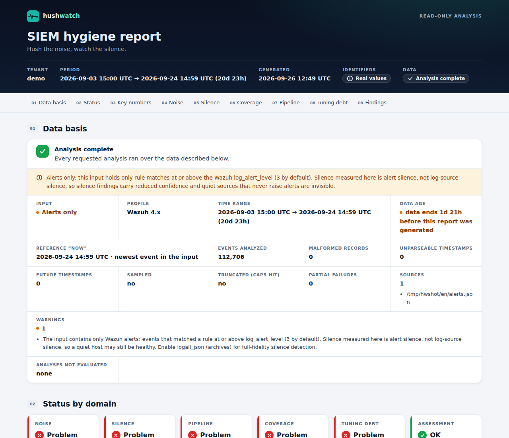
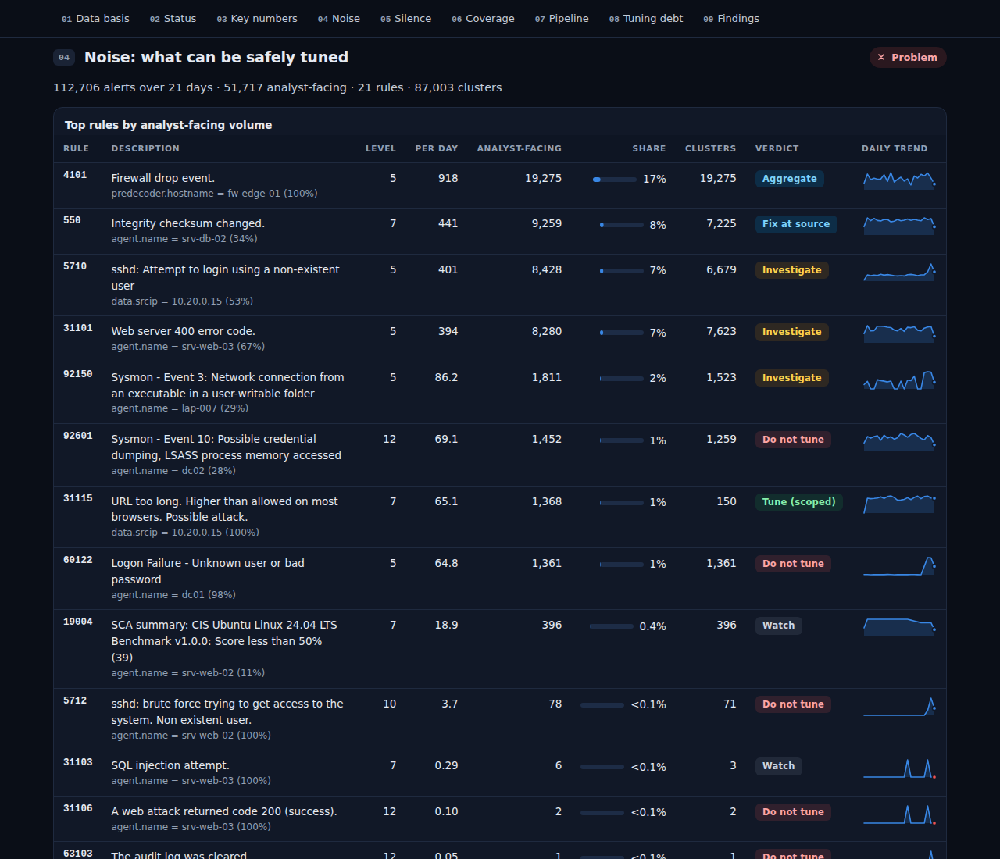

<div align="center">

# hushwatch

**Hush the noise. Watch the silence.**

SIEM hygiene for blue teams: find the alerts you can **safely** tune, and the detections that **quietly stopped working**.
First-class Wazuh support; Elastic / OpenSearch / generic exports too.

[](https://github.com/yosoyelpablo/limpiado-de-ruido/actions/workflows/ci.yml)


[Leer en español](README.es.md)



</div>

---

## Why

Every SOC fights the same two problems, and they are two faces of the same coin:

* **Noise.** Around half of all alerts are false positives and ~42% are never investigated
  (Microsoft/Omdia 2026, SANS 2025). Analysts drown; real attacks hide in the queue.
* **Silence.** A log source stops sending, a Sysmon channel dies, a parser loses a field after a firmware
  upgrade, an audit policy is switched off, a rule stops firing. Nothing alerts on *absence*, so detections
  die quietly — until the incident you did not see.

Commercial answers exist at enterprise prices. hushwatch is the open-source one — and it is built around a rule
most tuning tools ignore:

> **Noise looks like attacks.** Brute force, password spraying, scanning and C2 beaconing are high-volume,
> repetitive and concentrated — exactly what a naive "top noisy rules" script tells you to mute.
> hushwatch never recommends tuning without passing hard safety gates and a backtest.

## 60-second quickstart

```bash
pipx install git+https://github.com/yosoyelpablo/limpiado-de-ruido
hushwatch demo            # synthetic Wazuh dataset with planted problems + HTML report. No SIEM needed.
```

Then point it at your own data:

```bash
# Wazuh manager (read access to the alerts; run as a member of the 'wazuh' group, not root)
hushwatch report /var/ossec/logs/alerts/alerts.json \
  --ruleset /var/ossec/ruleset/rules --ruleset /var/ossec/etc/rules -f html -o report.html

# Spanish report, pseudonymized so you can share it with a client or vendor
hushwatch report alerts.json --lang es --redact -f html -o informe.html
```

## What it finds




| Domain | What you get | Example |
|---|---|---|
| **Noise** | Scoped, gated, backtested tuning suggestions — plus ready-to-review Wazuh rules | *"Rule 5710 from the internal scanner 10.20.0.15 = 52% of the rule, every night for 21 days. Demoting it removes ~200 analyst-facing alerts/day and hides no high-severity alert — review required: brute-force rule 5712 counts these events."* |
| | Noisy rules that must **not** be tuned, and why | *"5710 from 203.0.113.50: first seen 2 days ago, co-occurs with brute-force rule 5712 (level 10) → investigate, or restrict exposure."* |
| **Silence** | Sources, channels and rules that went quiet — calibrated, grouped by root cause | *"dc02 stopped sending 30 h ago, 20 min after 'audit log cleared' (1102) → possible defense evasion (T1070.001)."* |
| | Fields that disappeared | *"fw-edge-01 lost `data.dstport` on 2026-09-20 (100% → 0%) — every rule using it is blind."* |
| **Coverage** | Telemetry that was **never** collected | *"srv-app-01 never sent Sysmon; its Windows peers do."* · *"srv-app-02 logs 4624 but never 4688: process-creation auditing is off."* |
| **Pipeline** | Agents disconnected / alive-but-silent, manager drops, lag, clock skew | *"srv-mon-01 keepalive is fresh but no events for 3 days: collection is broken."* |
| **Tuning debt** | Risky EXISTING suppressions in your `local_rules.xml` | *"Rule 100010 mutes all of 5716 (no condition) and starves correlation rule 5720."* |

## Why you can trust the output

**Noise: never hide an attack**
* Suggestions are **scoped** (a rule plus 1–2 exact conditions on stable fields such as host, internal IP or
  service account), never "mute this rule".
* **Hard safety gates** decide each verdict:
  * novelty, persistence and burst checks;
  * co-occurrence with high-severity alerts on the same entity;
  * sensitive MITRE tactics;
  * public IPs (the answer is "restrict exposure", not a mute);
  * beacon-like periodicity;
  * interpreters and system binaries (PowerShell, cmd, rundll32...) are never enough on their own;
  * rules other correlation rules depend on;
  * true-positive dispositions.
* Every suggestion is **backtested**: it is replayed over the whole window with exactly the semantics of the
  generated rule, and downgraded if it would hide any high-level alert or confirmed true positive.
* Generated Wazuh rules **demote** the alert (they don't drop it, so it stays searchable) and use anchored, fully
  escaped PCRE2 patterns. Wazuh has no rule expiry, so each rule carries an expiry date in its description and
  `hushwatch audit` reports expired ones. When other correlation rules depend on the tuned rule (for example a
  brute-force frequency rule), or a sibling rule would be preempted, the suggestion is marked **REVIEW REQUIRED**
  and lists exactly which rules are affected. Every file comes with a validation checklist
  (`wazuh-analysisd -t`, `wazuh-logtest`, rollback).

**Silence: calibrated, not noisy**
* Expected volume per source is modelled by hour of day and day of week, in your timezone (DST-safe).
* Counts use a negative binomial model, because real logs are bursty.
* A source is flagged only when the probability of its current silence falls below an explicit **alarm budget**
  (default: 0.05 expected false alarms per run across all sources).
* A fleet-wide outage becomes **one** pipeline finding, not 400.
* Critical sources too sparse to monitor are reported as such, never marked "healthy".

**Never a false green**
* Every report starts with a **data basis** banner: what was analyzed, alerts-only vs full logs, time range,
  malformed data, partial failures.
* Anything that could not be assessed shows grey, not green.
* Incomplete analysis exits with code 3.

**Proven against planted attacks.** The demo dataset plants 26 scenarios. The test suite fails if hushwatch ever
suggests tuning something that would hide one of the planted attacks, or cries wolf on healthy laptops that are
simply switched off at night:
* brute force, password spray and C2 beacon;
* a macro spawning encoded PowerShell;
* log clearing before a DC goes dark;
* a dying Sysmon channel;
* a lost firewall field;
* risky legacy suppressions.

## What hushwatch will never do

* **Write to your SIEM.** It is read-only; suggested rules are files for a human to review.
* **Phone home.** No telemetry, no LLM, no cloud; network traffic goes only to endpoints you configure.
* **Take secrets on the command line.** Credentials come from `${ENV_VAR}` references in the config.
* **Disable TLS verification silently.** It is on by default; turning it off is a config setting that is
  printed on every report.

## Commands

| Command | Purpose |
|---|---|
| `hushwatch demo` | Generate a realistic Wazuh dataset with planted problems and analyze it |
| `hushwatch report [INPUTS]` | Everything: noise, silence, coverage, pipeline, tuning debt |
| `hushwatch noise [INPUTS]` | Only tuning analysis (`--emit-suppressions DIR` writes Wazuh rules) |
| `hushwatch silence [INPUTS]` | Only silence, coverage and pipeline health |
| `hushwatch audit RULES_DIRS...` | Audit existing Wazuh suppressions (pass the stock ruleset too so correlation checks can be verified) |
| `hushwatch check` | Cron mode: finding lifecycle (new / open / resolved / regressed / flapping), notify only on changes, heartbeats |
| `hushwatch fleet` | MSSP view: every tenant side by side |
| `hushwatch doctor` | Diagnose config, files, indexer, Wazuh API, TLS — with the exact fix |

Common options: `-f console|html|md|json`, `-o FILE`, `--lang en|es`, `--redact`, `--fail-on SEVERITY`,
`--since 21d`, `--now ISO`, `--dispositions verdicts.csv`, `--ruleset DIR` (repeatable), `--agents agents.json`,
`--force`, `-c config.yml -t tenant`.

> **Tip:** always pass the stock ruleset (`/var/ossec/ruleset/rules`) together with your local rules. Without it
> hushwatch cannot see which correlation rules depend on a noisy rule, so every suggestion is marked
> REVIEW REQUIRED and the analysis is flagged as incomplete.

**Exit codes:**
* `0`: clean;
* `1`: findings at or above `--fail-on`;
* `2`: usage or config error;
* `3`: analysis incomplete.

## Inputs

* **Wazuh 4.x:** `alerts.json` (live, rotated `.json.gz` directories, split files), `archives.json`, the indexer
  (`wazuh-alerts-*`, `wazuh-archives-*`) and the server API (agent inventory, keepalive, manager drop counters).
* **Elastic / OpenSearch:** ECS alerts (`kibana.alert.*`, including analyst workflow reasons as dispositions).
* **Anything else:** NDJSON / JSON / CSV exports (Splunk, Sentinel...) with a field mapping.

> **Tip:** Wazuh `alerts.json` only contains events that matched a rule at or above `log_alert_level`, so silence
> measured on alerts is *alert* silence. For full-fidelity source silence, enable `logall_json` and point
> hushwatch at `archives.json` / `wazuh-archives-*`. The report tells you which one you gave it.

## Configuration (multi-tenant)

One YAML file, with `defaults` inherited by each tenant. See [`examples/hushwatch.yml`](examples/hushwatch.yml).

```yaml
defaults:
  timezone: America/Argentina/Buenos_Aires
  triage_level: 7                  # alerts at/above this reach analysts
  criticality: {critical: ["dc*", "fw-*"], low: ["lap-*"]}
  trusted_entities: {user: [svc_backup], data.srcip: [10.20.0.15]}
tenants:
  acme:
    inputs:
      - {type: indexer, url: https://indexer.acme.example:9200, index: wazuh-alerts-*,
         username: "${ACME_USER}", password: "${ACME_PASSWORD}", ca_cert: /etc/hushwatch/acme-ca.pem}
    wazuh_api: {url: https://manager.acme.example:55000, username: "${ACME_API_USER}", password: "${ACME_API_PASSWORD}"}
    notify: [{type: slack, url: "${ACME_SLACK_WEBHOOK}"}]
```

**Minimal permissions:**
* **Indexer:** a read-only role with `read` and `view_index_metadata` on the index patterns.
* **Wazuh API:** a user allowed `agents:read`, `rules:read` and `manager:read`.

## How it compares

| | Noise ranking | Safety-gated tuning + backtest | Generates Wazuh rules | Source / channel silence | Tuning-debt audit | Open source |
|---|:-:|:-:|:-:|:-:|:-:|:-:|
| **hushwatch** | ✅ | ✅ | ✅ | ✅ (Wazuh, ECS, generic) | ✅ | ✅ |
| Dashboard "top noisy rules" | ✅ | – | – | – | – | varies |
| Elastic rule monitoring | – | – | – | rule execution only | – | ✅ (Elastic only) |
| TrackMe | – | – | – | ✅ (Splunk only) | – | ✅ |
| DeTT&CT | – | – | – | manual scoring | – | ✅ |
| Commercial detection-posture platforms | ✅ | varies | – | ✅ | varies | – |

## Roadmap

* Data-aware Sigma rule health check (pySigma): will this rule fire on *your* fields and event types?
* ATT&CK Navigator layer of coverage that is actually alive, not coverage on paper.
* Elastic exception and alert-suppression output; Wazuh 5.x (Sigma engine) output.
* Aggregation-first indexer path for very large archive indices.

## Development

```bash
python -m pip install -e ".[dev]"
ruff check . && ruff format --check . && mypy hushwatch && pytest
```

Design documents:
* [`docs/architecture.md`](docs/architecture.md): the contract between modules;
* [`docs/threat-model.md`](docs/threat-model.md): what we defend against.

Security issues: see [SECURITY.md](SECURITY.md). Licensed under [Apache-2.0](LICENSE).
